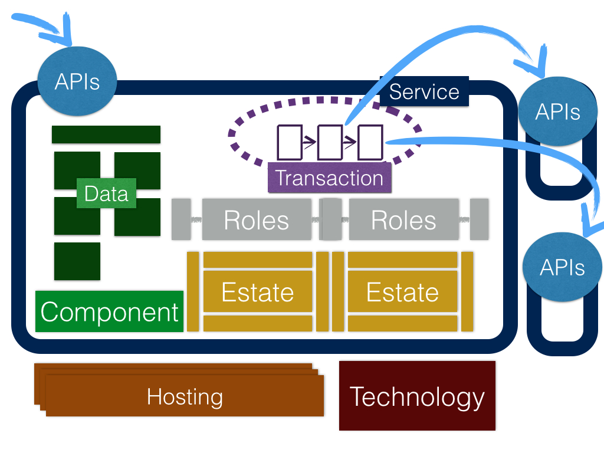

Architecture Language
=====================

## Primary User Needs:
 * As a technical architect, I want to converse with my colleagues, so I need a shared language
 * As a technical architect, I want to be able to catalogue and describe services, so I can share them with colleagues and help others locate other services and assets they may need
 * As a senior leader, I want to understand that the architecture will meet my business needs, so we need an clear reporting language
 * As a planner, I want to know when the thing will be delivered, so we need the ability to explain dependencies, timescales etc.

The language is split into three parts – service definition, service ‘management’, and technical.

Service definition terms
========================

| What      |  Service          |
| ----      |  -------          |
| Who       | Role              |
| Where     | Estate, Hosting   |
| With what | Technology        |
| How       | Component         |
| How much  | Quality           |

Service
-------
We define a service as a unit of government behaviour important enough to have a service manager permanently and probably uniquely assigned to it. In a sense it is a ‘business’ Service – it encompasses people, process and technology – but following the ‘digital by default’ policy. So they are information services as well.
A service encapsulates data.
We probably want to include ‘transformation’ aspects such as what legacy integration patterns are being used.

Transaction
-----------
A user journey through a number of steps requiring an exchange between two or more parties to achieve a specific user goal. See also Designing transactions. The transaction may be digital or face-to-face, though the latter should be recorded in a digital format.
A service may support more than one transaction and a transaction may span more than one service. For example, changing address with DVLA, could require updating address with Home Office at some point.
As an implementation note we may want to favour front end service choreography, integrating through the web layer, more than back end service choreography. So a user journey could skip from one service to another, linking through the user’s browser. This allows quick and easy service composition. 
A transaction has a number of steps which may or may not be automated.

Data
----
Information owned by a service. Some is communicated through APIs or directly to users through an interface.

API
---
Application programming interface – the way in which a service can be interacted with automatically. Well-defined user interfaces can also be built on top of clean semantic web APIs so the user interface and automatic interfaces should usually be very similar.

Quality
-------
Qualities are attributes of other elements, eg services, that describe the actual and desired characteristics and whether they fit user needs. Each service will probably go through its own quality assurance analysis. We should be able to find a number of common qualities however, that we can use to categorise elements.
For example we could offer a reference implementation of a particular technology, and prove it works up to a certain ‘load’ quality point. The performance platform requires a few consistently reported quality metrics for instance. Security is also another area of common quality concerns.
A useful way of assessing quality is by assessing the architecture through a set of scenarios relevant stakeholders raise (usually because their experience warns them there is a risk there). A useful example process is the architecture tradeoff analysis method.

Component
---------
A component piece of useful code, content, data or tooling that can be deployed in many services. So data owned by a component isn’t located in a single service. Eg Addresses (data format, sharing, lookup, example code) could be a component. There may be many implementations of the same component. We want to find components and encourage reuse.

Technology
----------
Technologies are used to identify how services are constructed.

Hosting
-------
Hosting defines where live service components (technology) are deployed. We want to understand this because it affects the cost, flexibility and certain risk factors for a service.

Role
----
Who would use the service (including numbers), citizen and business users, civil cervant and other agency users.

Estate
------
Where is the service accessed by people – especially offices. We record this to aid in understanding any changes to the business operating model.

References
----------
For each service or component we can point to one or more references to underpin its utility. References may be case studies, prototype implementations and example parts of actual working services. Also any service or component can be marked as a referenceable example.

Service management terms
========================

As an architecture function we need to perform enough data to manage our resources and priority across many services. To do that we will maintain a view of key events, issues, risks and priorities. If where our effort aligns with the scope of management portfolio we will align our views with the portfolio's management. We aim to not have to maintain these items ourselves 'just' for architecture scope.
 
Issue
-----
An architecture issue is an issue raised by a concerned stakeholder bringing attention to a particular question that needs to be asked, an incident, a perceived risk, a perceived problem, or anything else that needs to be managed and responded to by the architecture function.

Risk
----
Something that might happen or has happened so might happen again. Architecture risks should be consolidated to a limited number of risk factors, probably mapped to qualities. We would like to get to the position in which we can model risk in a consistent way across services. 

Milestone
---------
An expected event that is coming up. We need to maintain roadmaps against services, components, technologies, etc. in order to predict or advise, and to manage prioritisation against a planning horizon.

Cost, Value
-----------

Technical terms
===============

Microservice – a technical model of service. When we mean a technical service we will always say 'microservice'. It is a similar concept to service – fulfills a coherent set of needs through behaviour and data encapsulated in a well defined interface – but it is purely a technical construct. Often smaller than services in scope. 
 A service willbe realised by many microservices. But also by people, process, budget and all the other things a service manager is concerned with. 

